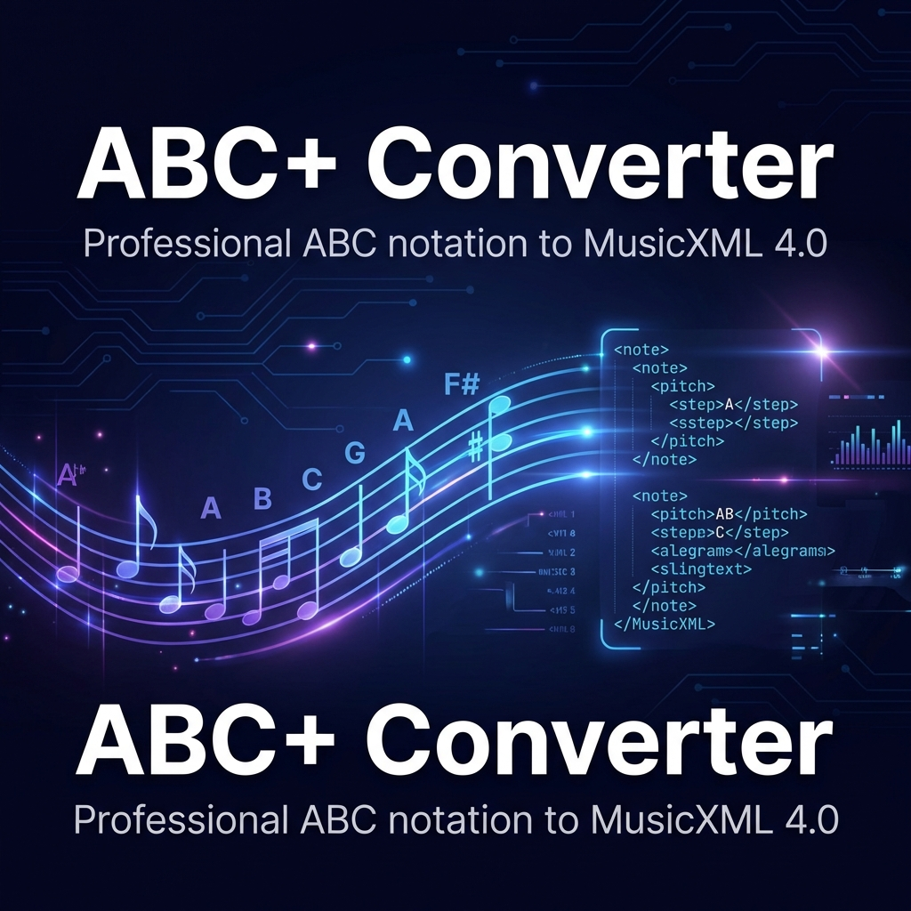

# ABC+ Converter 🎼 ➔ 📄



## The Bridge Between ABC Simplicity and MusicXML Power

**ABC+ Converter** is a professional-grade, cross-platform engine designed to translate advanced ABC notation into high-fidelity **MusicXML 4.0**.

Designed for composers, engravers, and researchers, ABC+ goes beyond standard converters by supporting a rich set of modern musical directives, including swing playback, complex orchestral layout, figured bass, and custom articulations.

[](https://github.com/leedale30/abc-to-xml-converter/releases)
[](https://github.com/leedale30/abc-to-xml-converter/actions)
[](LICENSE)
[](https://www.musicxml.com/)

---

### ✨ Key Features

- **🎯 Precision MusicXML 4.0**: Fully compatible with MuseScore 4, Sibelius, and Finale.
- **🎹 Advanced Playback**: Native interpretation of `%%swing` and `%%mute` for professional MIDI/XML previews.
- **📏 Pro Layout Controls**: Fine-grained vertical orchestration with `%%vskip` and custom `%%sep` separators.
- **🎻 Orchestral Power**: Support for complex `@above`/`@below` placements, detailed ornaments, and technical notations.
- **🎸 Continuo & Chords**: High-fidelity Figured Bass and Guitar Frame support.
- **🖥️ Cross-Platform**: Native binaries for **macOS**, **Windows**, and **Linux**.
- **🌐 Interactive Workflow**: Includes a sleek, local web interface for real-time conversion and session management.

---

### 📥 Downloads

Get the latest production-ready version (+1.2.0):

| Platform | Format | Link |
| :--- | :--- | :--- |
| **macOS** | `.app` | [Download Universal](https://github.com/leedale30/abc-to-xml-converter/releases/latest) |
| **Windows** | `.exe` | [Download x64](https://github.com/leedale30/abc-to-xml-converter/releases/latest) |
| **Linux** | Binary | [Download x64](https://github.com/leedale30/abc-to-xml-converter/releases/latest) |

---

### 📖 Documentation & Spec

ABC+ is defined by a rigorous extension of the ABC 2.1 standard.

- **[ABC+ Specification](./abc-plus-spec/SPECIFICATION.md)**: The definitive syntax guide.
- **[Feature Matrix](./FEATURES.md)**: Every supported MusicXML 4.0 element.
- **[Showcase](./examples/README.md)**: Real-world examples (Bossa Nova, Orchestral, etc.).
- **[Issues](https://github.com/leedale30/abc-to-xml-converter/issues)**: Something not working? Let us know.

---

### 🛠 Installation (Developers)

```bash
# Clone with submodules
git clone --recurse-submodules https://github.com/leedale30/abc-to-xml-converter.git
cd abc-to-xml-converter

# Install dependencies
pip install -r requirements.txt

# Launch the interactive app
python app.py
```

---

### 🤝 Contributing

We welcome contributions! Please see our [Contributing Guidelines](CONTRIBUTING.md) and [Security Policy](SECURITY.md).

---

### 📄 License

This project is licensed under the **MIT License**. See the [LICENSE](LICENSE) file for details.

*Created and maintained by [Antony Leedale](https://github.com/leedale30).*
