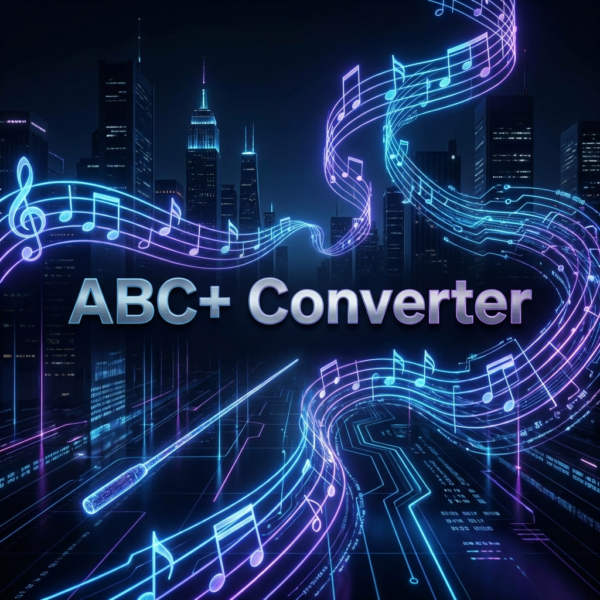

# ABC+ Converter



## The Bridge Between ABC Simplicity and MusicXML Power

**ABC+ Converter** is a professional-grade, cross-platform application designed to convert advanced ABC notation into high-fidelity **MusicXML 4.0**.

Unlike standard converters, ABC+ supports a rich set of modern musical directives including swing playback, advanced layout controls, figured bass, chord diagrams, and complex orchestral notations.

[](https://github.com/leedale30/abc-to-xml-converter/releases)
[](https://github.com/leedale30/abc-to-xml-converter/actions)
[](https://www.gnu.org/licenses/lgpl-3.0)

---

### 🚀 Key Features

- **MusicXML 4.0 Support**: Implements the latest industry-standard features for maximum compatibility with MuseScore 4, Sibelius, and Finale.
- **Advanced Playback**: Native support for `%%swing` and `%%mute` directives.
- **Pro Layout Controls**: Fine-grained vertical spacing with `%%vskip` and separators with `%%sep`.
- **Figured Bass & Chord Frames**: Full support for Baroque continuo and modern guitar chord diagrams.
- **Cross-Platform**: Available as a native macOS App, Windows Executable, and Linux Binary.
- **Interactive UI**: A sleek Flask-based local web interface for real-time conversion and session management.

---

### 📥 Installation & Downloads

The latest version of ABC+ Converter is **v1.2.1**.

| Platform | Download Link |
| :--- | :--- |
| **macOS** | [Download .app (Universal)](https://github.com/leedale30/abc-to-xml-converter/releases/latest) |
| **Windows** | [Download .exe (64-bit)](https://github.com/leedale30/abc-to-xml-converter/releases/latest) |
| **Linux** | [Download Binary (AppImage soon)](https://github.com/leedale30/abc-to-xml-converter/releases/latest) |

---

### 📖 Documentation

ABC+ is powered by a robust specification that extends the standard ABC 2.1 format.

- **[ABC+ Specification](./abc-plus-spec/SPECIFICATION.md)**: The core syntax guide.
- **[Feature Matrix](./FEATURES.md)**: A detailed list of supported MusicXML elements.
- **[Implementation Checklist](./abc-plus-spec/CHECKLIST.md)**: Track our progress towards 100% MusicXML coverage.
- **[Developer Guide](./abc-plus-spec/INTEGRATION.md)**: How to integrate the ABC+ spec into your own tools.

---

### 🛠 Quick Start (Developers)

If you want to run the ABC+ Converter from source:

1. **Clone the repository with submodules**:

   ```bash
   git clone --recurse-submodules https://github.com/leedale30/abc-to-xml-converter.git
   cd abc-to-xml-converter
   ```

2. **Install dependencies**:

   ```bash
   pip install -r requirements.txt
   ```

3. **Run the application**:

   ```bash
   python app.py
   ```

   *Your browser will open automatically at `http://127.0.0.1:5000`.*

---

### 🤝 Contributing

We are on a mission to make ABC the most powerful shorthand for musical notation. Contributions to the `abc2xml` engine or the ABC+ specification are welcome!

1. Fork the repo.
2. Create your feature branch (`git checkout -b feature/AmazingFeature`).
3. Commit your changes.
4. Push to the branch.
5. Open a Pull Request.

---

### 📄 License

This project is licensed under the **GNU Lesser General Public License v3 (LGPLv3)** - see the [abc2xml/LICENSE](abc2xml/LICENSE) file for details.

---

*Created and maintained by [Antony Leedale](https://github.com/leedale30).*
