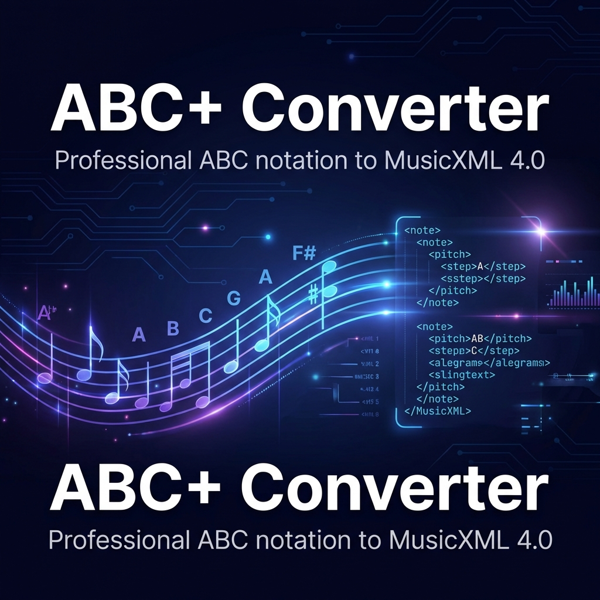

# ABC+ Converter 🎼 ➔ 📄



## The Bridge Between ABC Simplicity and MusicXML Power

**ABC+ Converter** is a professional-grade, cross-platform engine designed to translate advanced ABC notation into high-fidelity **MusicXML 4.0**.

Designed for composers, engravers, and researchers, ABC+ goes beyond standard converters by supporting a rich set of modern musical directives, including swing playback, complex orchestral layout, figured bass, and custom articulations.

[](https://github.com/leedale30/abc-to-xml-converter/releases)
[](https://github.com/leedale30/abc-to-xml-converter/actions)
[](LICENSE)
[](https://www.musicxml.com/)

---

### ✨ Key Features

- **🎯 Precision MusicXML 4.0**: Fully compatible with MuseScore 4, Sibelius, and Finale.
- **🎹 Advanced Playback & Tab**: Native interpretation of `%%swing`, `%%mute`, and automatic **Tin Whistle Tablature** generation.
- **📏 Pro Layout Controls**: Fine-grained vertical orchestration with `%%vskip`, `%%lyrics-above`, and custom `%%sep` separators.
- **🎻 Orchestral Power**: Support for complex `@above`/`@below` placements (including technical notations and fingerings).
- **🎸 Continuo & Chords**: High-fidelity Figured Bass and Guitar Frame support.
- **🖥️ Cross-Platform**: Native binaries for **macOS**, **Windows**, and **Linux**.
- **🌐 Interactive Workflow**: Includes a sleek, local web interface for real-time conversion and session management.
- **🔄 Multi-Format Support**: Convert ABC+ to MusicXML, MIDI, LilyPond, and other formats with a single click.
- **🚀 Batch Processing**: Generate all supported formats simultaneously for efficient workflow.
- **🎼 High-Quality MIDI**: Uses abcmidi for professional-grade MIDI conversion.
- **📝 LilyPond Integration**: Direct conversion to LilyPond format for advanced typesetting.

---

### 📥 Downloads

Get the latest production-ready version (**v1.3.1**):

| Platform | Format | Link |
| :--- | :--- | :--- |
| **macOS** | `.app` | [Download Universal](https://github.com/leedale30/abc-to-xml-converter/releases/latest) |
| **Windows** | `.exe` | [Download x64](https://github.com/leedale30/abc-to-xml-converter/releases/latest) |
| **Linux** | Binary | [Download x64](https://github.com/leedale30/abc-to-xml-converter/releases/latest) |

---

### 📖 Documentation & Spec

ABC+ is defined by a rigorous extension of the ABC 2.1 standard.

- **[ABC+ Specification](./abc-plus-spec/SPECIFICATION.md)**: The definitive syntax guide (v1.4.0).
- **[Feature Matrix](./FEATURES.md)**: Every supported MusicXML 4.0 element.
- **[Showcase](./examples/README.md)**: Real-world examples (Bossa Nova, Orchestral, etc.).
- **[Issues](https://github.com/leedale30/abc-to-xml-converter/issues)**: Something not working? Let us know.

---

### 🛠 Installation (Developers)

```bash
# Clone with submodules
git clone --recurse-submodules https://github.com/leedale30/abc-to-xml-converter.git
cd abc-to-xml-converter

# Install dependencies
pip install -r requirements.txt

# Launch the interactive app
python app.py
```

---

### 🌐 API Endpoints

The ABC+ Converter provides a RESTful API for programmatic access to conversion functionality:

#### `POST /convert`
- **Description**: Convert ABC+ to MusicXML
- **Request**: `{"abc_content": "..."}`
- **Response**: `{"xml_content": "...", "logs": "..."}`

#### `POST /convert-to`
- **Description**: Convert ABC+ to various formats
- **Request**: `{"abc_content": "...", "format": "midi|musicxml|lilypond|mei|abc"}`
- **Response**: Binary file download

#### `POST /convert-to-midi`
- **Description**: Convert ABC+ to MIDI using abcmidi
- **Request**: `{"abc_content": "..."}`
- **Response**: MIDI file download

#### `POST /convert-to-lilypond`
- **Description**: Convert ABC+ to LilyPond using abc2ly
- **Request**: `{"abc_content": "..."}`
- **Response**: `{"ly_content": "...", "logs": "..."}`

#### `POST /convert-to-all`
- **Description**: Convert ABC+ to all supported formats and return as a zip file
- **Request**: `{"abc_content": "..."}`
- **Response**: Zip file download containing all formats

#### `POST /save`
- **Description**: Save conversion session
- **Request**: `{"abc_content": "...", "xml_content": "...", "logs": "..."}`
- **Response**: `{"message": "...", "path": "..."}`

#### `GET /check-update`
- **Description**: Check for software updates
- **Response**: `{"update_available": true/false, "current_version": "...", "latest_version": "...", "download_url": "..."}`

---

### 📖 Usage Examples

#### Python Example

```python
import requests

# Convert ABC to MusicXML
response = requests.post('http://127.0.0.1:5001/convert', json={
    'abc_content': 'X:1\nT:Test\nM:4/4\nL:1/8\nK:C\nC D E F G A B c'
})

if response.status_code == 200:
    result = response.json()
    print(result['xml_content'])

# Convert ABC to MIDI
response = requests.post('http://127.0.0.1:5001/convert-to-midi', json={
    'abc_content': 'X:1\nT:Test\nM:4/4\nL:1/8\nK:C\nC D E F G A B c'
})

if response.status_code == 200:
    with open('output.mid', 'wb') as f:
        f.write(response.content)
```

#### cURL Example

```bash
# Convert ABC to MusicXML
curl -X POST http://127.0.0.1:5001/convert \
  -H "Content-Type: application/json" \
  -d '{"abc_content": "X:1\nT:Test\nM:4/4\nL:1/8\nK:C\nC D E F G A B c"}'

# Convert ABC to MIDI and save to file
curl -X POST http://127.0.0.1:5001/convert-to-midi \
  -H "Content-Type: application/json" \
  -d '{"abc_content": "X:1\nT:Test\nM:4/4\nL:1/8\nK:C\nC D E F G A B c"}' \
  -o output.mid

# Convert to all formats and save as zip
curl -X POST http://127.0.0.1:5001/convert-to-all \
  -H "Content-Type: application/json" \
  -d '{"abc_content": "X:1\nT:Test\nM:4/4\nL:1/8\nK:C\nC D E F G A B c"}' \
  -o all_formats.zip
```

---

### 🤝 Contributing

We welcome contributions! Please see our [Contributing Guidelines](CONTRIBUTING.md) and [Security Policy](SECURITY.md).

---

### 📄 License

This project is licensed under the **MIT License**. See the [LICENSE](LICENSE) file for details.

*Created and maintained by [Antony Leedale](https://github.com/leedale30).*
